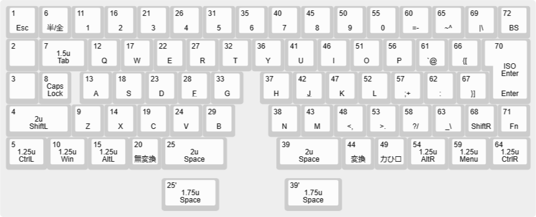

# Build Guide〔BETA〕
Beta版のビルドガイドです。PCBの裏面には「いい風来てる？　試製Summer Zephyr Lite Edition」と表記されています。
## 内容物の確認
- PCB
  使用時に上を向く面を「表」、使用時に下を向く面を「裏」と呼称します。
- スイッチプレート
- バックパネル
- スペーサー
- ネジ
- ナット

## 必須パーツの用意
 - RP2040-Zero
   1個
 - MXキースイッチ
   70個
 - MXキーソケット
   6個
 - MX軸キーキャップ  
   1セット JIS配列推奨
   ※「キーキャップの選定」参照
 - ダイオード  
   70個 1N4148 表面実装
 - MX用 2Uスタビライザー  
   2～4個

## 推奨パーツの用意
- ピンヘッダ
  実装用ではなく、途中の作業で治具として用います。

## 必須データのダウンロード
- summer_zephyr_vial.uf2  
[こちら](/firmware/)にあります。ダウンロードしておいてください。
ビルドガイド内で.uf2ファイル、ファームウェア、と呼称されるものがあればすべてこちらのファイルのことです。
  
## キーキャップの選定
一部のキーを特殊な幅に設定しています。以下のリストをよく確認してください。  

- Caps Lock 1u
- Shift 2u
- Shift 1u
- Space 1.75uまたは2uを合計2個
- その他ファンクションキー4個  
実際の配列は[Keyboard Layout Editor](http://www.keyboard-layout-editor.com/##@@=1%0A%0A%0A%0A%0A%0A%0A%0A%0A%0AEsc&=6%0A%0A%0A%0A%0A%0A%0A%0A%0A%0A%E5%8D%8A%2F%2F%E5%85%A8&=11%0A%0A%0A%0A%0A%0A%0A%0A%0A%0A1&=16%0A%0A%0A%0A%0A%0A%0A%0A%0A%0A2&=21%0A%0A%0A%0A%0A%0A%0A%0A%0A%0A3&=26%0A%0A%0A%0A%0A%0A%0A%0A%0A%0A4&=31%0A%0A%0A%0A%0A%0A%0A%0A%0A%0A5&=35%0A%0A%0A%0A%0A%0A%0A%0A%0A%0A6&=40%0A%0A%0A%0A%0A%0A%0A%0A%0A%0A7&=45%0A%0A%0A%0A%0A%0A%0A%0A%0A%0A8&=50%0A%0A%0A%0A%0A%0A%0A%0A%0A%0A9&=55%0A%0A%0A%0A%0A%0A%0A%0A%0A%0A0&=60%0A%0A%0A%0A%0A%0A%0A%0A%0A%0A%2F=-&=65%0A%0A%0A%0A%0A%0A%0A%0A%0A%0A~%5E&=69%0A%0A%0A%0A%0A%0A%0A%0A%0A%0A%7C%5C&=72%0A%0A%0A%0A%0A%0A%0A%0A%0A%0ABS%3B&@=2&_w:1.5%3B&=7%0A%0A%0A%0A%0A%0A%0A%0A%0A1.5u%0ATab&=12%0A%0A%0A%0A%0A%0A%0A%0A%0A%0AQ&=17%0A%0A%0A%0A%0A%0A%0A%0A%0A%0AW&=22%0A%0A%0A%0A%0A%0A%0A%0A%0A%0AE&=27%0A%0A%0A%0A%0A%0A%0A%0A%0A%0AR&=32%0A%0A%0A%0A%0A%0A%0A%0A%0A%0AT&=36%0A%0A%0A%0A%0A%0A%0A%0A%0A%0AY&=41%0A%0A%0A%0A%0A%0A%0A%0A%0A%0AU&=46%0A%0A%0A%0A%0A%0A%0A%0A%0A%0AI&=51%0A%0A%0A%0A%0A%0A%0A%0A%0A%0AO&=56%0A%0A%0A%0A%0A%0A%0A%0A%0A%0AP&=61%0A%0A%0A%0A%0A%0A%0A%0A%0A%0A%60%2F@&=66%0A%0A%0A%0A%0A%0A%0A%0A%0A%0A%7B%5B&_x:0.25&w:1.25&h:2&w2:1.5&h2:1&x2:-0.25%3B&=70%0A%0A%0A%0A%0A%0A%0A%0A%0AISO%20Enter%0AEnter%3B&@=3&=8%0A%0A%0A%0A%0A%0A%0A%0A%0A%0ACaps%20Lock&_x:0.25%3B&=13%0A%0A%0A%0A%0A%0A%0A%0A%0A%0AA&=18%0A%0A%0A%0A%0A%0A%0A%0A%0A%0AS&=23%0A%0A%0A%0A%0A%0A%0A%0A%0A%0AD&_n:true%3B&=28%0A%0A%0A%0A%0A%0A%0A%0A%0A%0AF&=33%0A%0A%0A%0A%0A%0A%0A%0A%0A%0AG&_x:0.5%3B&=37%0A%0A%0A%0A%0A%0A%0A%0A%0A%0AH&_n:true%3B&=42%0A%0A%0A%0A%0A%0A%0A%0A%0A%0AJ&=47%0A%0A%0A%0A%0A%0A%0A%0A%0A%0AK&=52%0A%0A%0A%0A%0A%0A%0A%0A%0A%0AL&=57%0A%0A%0A%0A%0A%0A%0A%0A%0A%0A%2F%3B+&=62%0A%0A%0A%0A%0A%0A%0A%0A%0A%0A%2F:&=67%0A%0A%0A%0A%0A%0A%0A%0A%0A%0A%7D%5D%3B&@_w:2%3B&=4%0A%0A%0A%0A%0A%0A%0A%0A%0A2u%0AShiftL&=9%0A%0A%0A%0A%0A%0A%0A%0A%0A%0AZ&=14%0A%0A%0A%0A%0A%0A%0A%0A%0A%0AX&=19%0A%0A%0A%0A%0A%0A%0A%0A%0A%0AC&=24%0A%0A%0A%0A%0A%0A%0A%0A%0A%0AV&=29%0A%0A%0A%0A%0A%0A%0A%0A%0A%0AB&_x:1%3B&=38%0A%0A%0A%0A%0A%0A%0A%0A%0A%0AN&=43%0A%0A%0A%0A%0A%0A%0A%0A%0A%0AM&=48%0A%0A%0A%0A%0A%0A%0A%0A%0A%0A%3C,&=53%0A%0A%0A%0A%0A%0A%0A%0A%0A%0A%3E.&=58%0A%0A%0A%0A%0A%0A%0A%0A%0A%0A%3F%2F%2F&=63%0A%0A%0A%0A%0A%0A%0A%0A%0A%0A%2F_%5C&=68%0A%0A%0A%0A%0A%0A%0A%0A%0A%0AShiftR&=71%0A%0A%0A%0A%0A%0A%0A%0A%0A%0AFn%3B&@_w:1.25%3B&=5%0A%0A%0A%0A%0A%0A%0A%0A%0A1.25u%0ACtrlL&_w:1.25%3B&=10%0A%0A%0A%0A%0A%0A%0A%0A%0A1.25u%0AWin&_w:1.25%3B&=15%0A%0A%0A%0A%0A%0A%0A%0A%0A1.25u%0AAltL&=20%0A%0A%0A%0A%0A%0A%0A%0A%0A%0A%E7%84%A1%E5%A4%89%E6%8F%9B&_w:2%3B&=25%0A%0A%0A%0A%0A%0A%0A%0A%0A2u%0ASpace&_x:1.5&w:2%3B&=39%0A%0A%0A%0A%0A%0A%0A%0A%0A2u%0ASpace&=44%0A%0A%0A%0A%0A%0A%0A%0A%0A%0A%E5%A4%89%E6%8F%9B&=49%0A%0A%0A%0A%0A%0A%0A%0A%0A%0A%E3%82%AB%E3%81%B2%E3%83%AD&_w:1.25%3B&=54%0A%0A%0A%0A%0A%0A%0A%0A%0A1.25u%0AAltR&_w:1.25%3B&=59%0A%0A%0A%0A%0A%0A%0A%0A%0A1.25u%0AMenu&_w:1.25%3B&=64%0A%0A%0A%0A%0A%0A%0A%0A%0A1.25u%0ACtrlR%3B&@_y:0.25&x:4.75&w:1.75%3B&=25'%0A%0A%0A%0A%0A%0A%0A%0A%0A1.75u%0ASpace&_x:2&w:1.75%3B&=39'%0A%0A%0A%0A%0A%0A%0A%0A%0A1.75u%0ASpace)からも確認できます。

## ざっくり組み立て(組み立てに慣れた人向け)
おてがるガイドですまない。  
普通の自作キーボードと同じノリで組みます  
RP2040-ZeroはPCB裏面に載せ、端子とスイッチは表に向くように表面実装します。シルクの表示とピンの表示を合わせてください。  
位置がずれる時は適当なピンヘッダかコンスルーを刺しておくと安定します。

## しっかり組み立て(全部解説)
### RP2040-Zeroの作業
本キーボードのシステムを司る部品です。本ガイド中ではRP2040と表記します。    
RP2040のBOOTを押しながらPCに接続し、ストレージとして認識されたら.uf2ファイルをコピーします。  
これでストレージとしては認識されなくなり、かわりにHIDとして接続された状態になります。  
ここまでの作業が問題なく行えればRP2040は間違いなく動作しているはずです。

### 〈推奨〉キースイッチの検査
テスターを使用してキースイッチの導通を一つずつ確認します。  
Beta基板ではすべてはんだづけしてしまうことになるため、万一初期不良があった場合は交換が面倒になります。  

### はんだづけ(1回目)
ダイオードを最初にはんだづけします。基板裏の表示に合わせて実装してください。  
次にスイッチソケットをはんだづけします。こちらも表示の通りに実装します。
最後にRP2040をはんだづけします。図のように基板の裏から切り欠きに合わせて乗せ、ランドに合わせて実装します。ズレる場合はピンヘッダやコンスルーを刺しておくと安定します。  

### 組み立て(1回目)　
先んじてスタビライザーを導入します。左右のSpaceは、2Uキーキャップを用いるのであれば導入し、1.75Uキーキャップの場合は導入せずに使用します。  
スイッチプレートの表側からネジを通し、裏からネジつきスペーサーで固定し、基板を乗せます。  
ソケットがある場所含め、スイッチをすべて挿入します。  
スイッチの脚が基板の穴に間違いなく通るようにしてください。

### はんだづけ(2回目)
スイッチやプレートが浮いていないのを確認しつつ、スイッチの脚をすべてはんだ付けします。

### 検査
[Vial](https://vial.rocks/)を起動し、Matrix Testerに移動してスイッチがそれぞれ間違いなく反応しているかを確認します。
行・列まとめて反応しないスイッチがある場合、RP2040のはんだづけを疑います。  
単体で反応しないスイッチがある、または別のスイッチが反応してしまう場合、まずダイオードのはんだ付けと向きを確認してください。稀にスイッチ自体が壊れていることもあります。  
すべて間違いなく反応したら、このキーボードは使用できる状態になっています。

### 組み立て(2回目)
基板を裏向けて、ネジが上向きに露出している状態にします。  
バックパネルが1枚の場合は、スペーサ(2mm)をネジに通し、そのままパネルを乗せてナットで固定します。  
バックパネルが2枚構成の場合は、ソケット型の穴がある方を先に重ね、上からネジ穴のみの方をのせ、ナットで固定します。  
